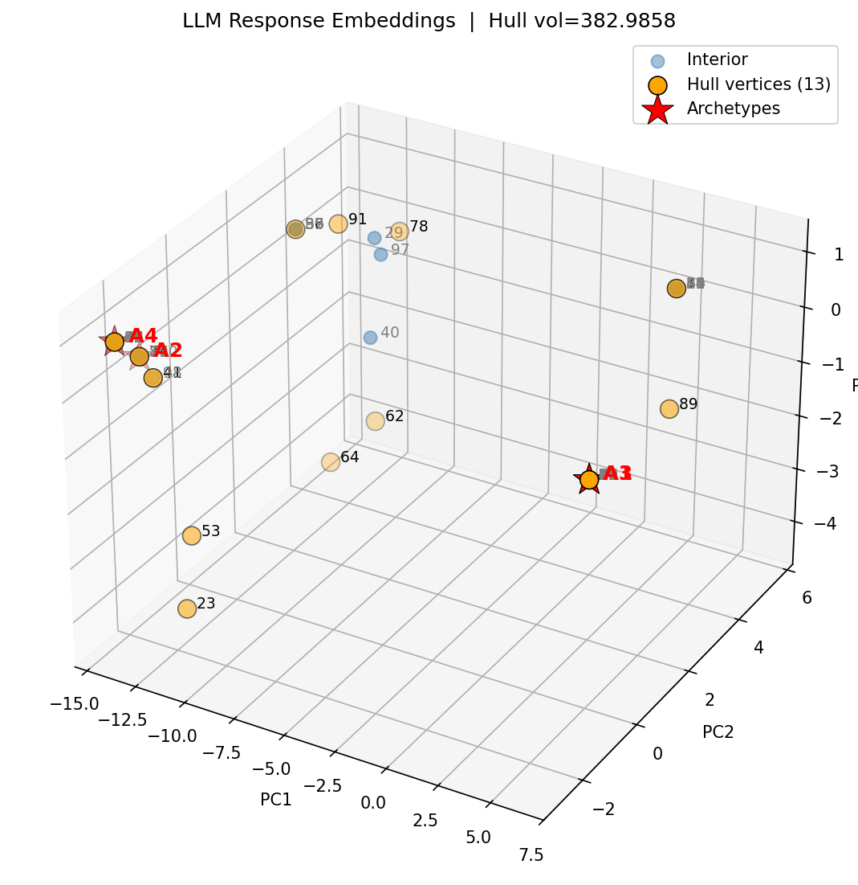
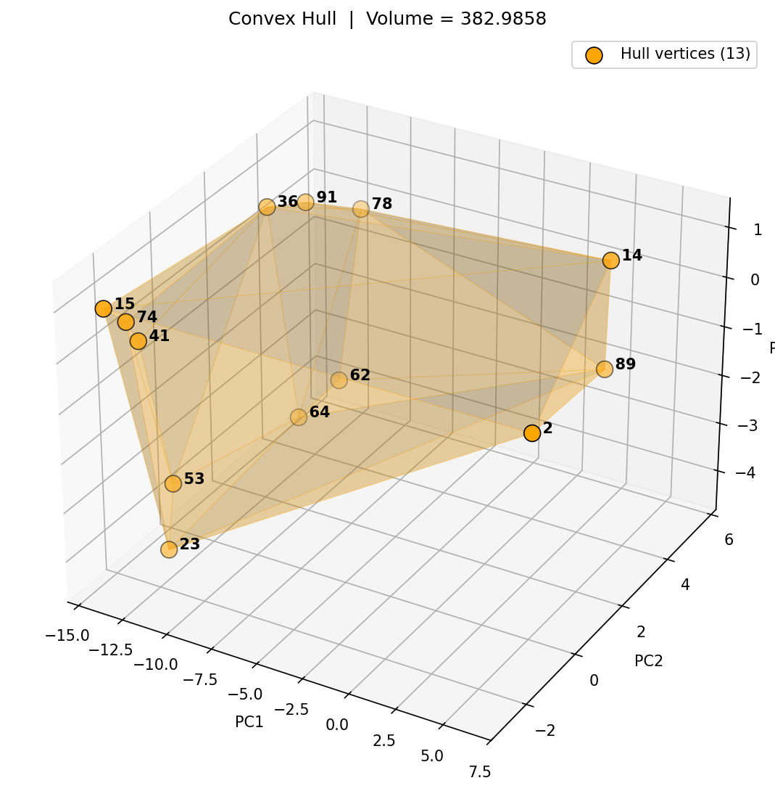
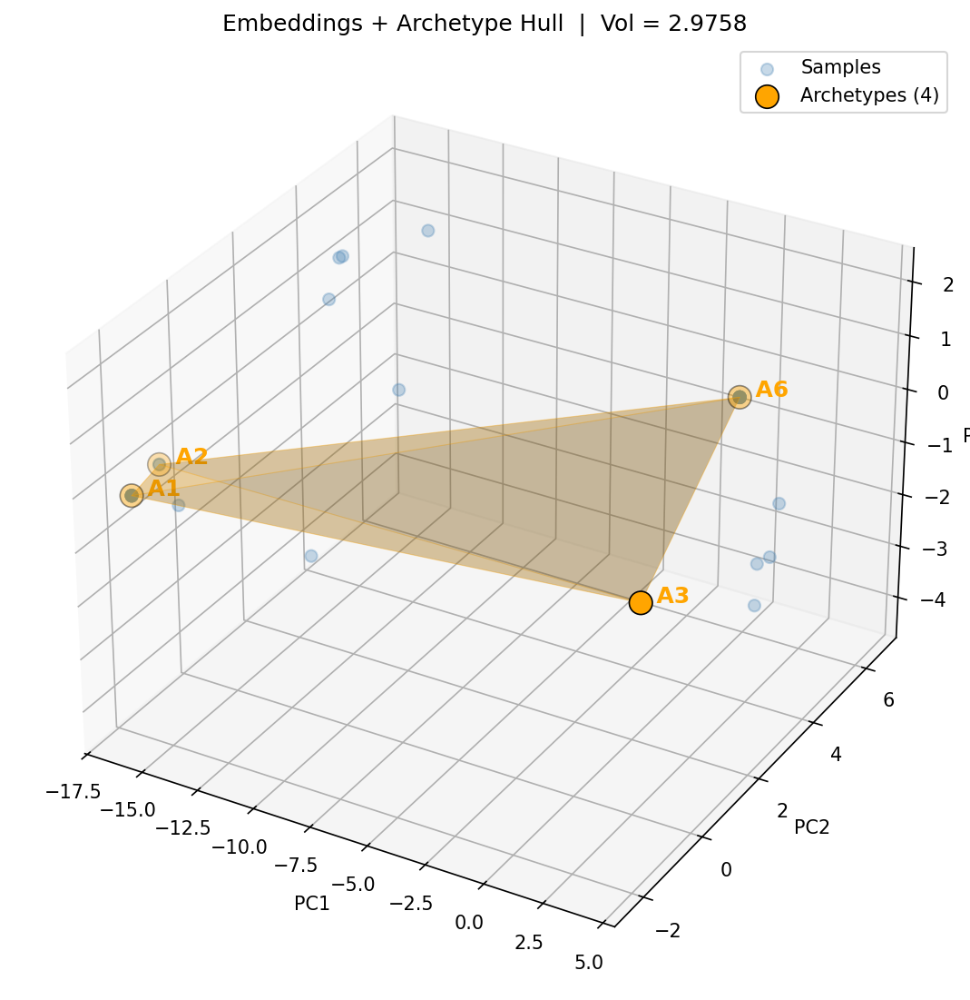

# Geometric Uncertainty Estimation for LLMs

A tool for detecting LLM hallucination by analyzing the geometric structure of response embeddings in high-dimensional space. The core insight: when an LLM is prompted repeatedly with non-zero temperature, the spread and shape of responses in embedding space is a signal of model uncertainty — and by extension, likely hallucination.

## How It Works

1. **Sample** — Query a local LLM (via Ollama) N times for the same prompt at a given temperature
2. **Embed** — Convert each response to a high-dimensional embedding vector (via `nomic-embed-text`)
3. **PCA** — Project embeddings into 3D principal component space
4. **Archetypal Analysis** — Find extreme "archetype" responses (corners of the response distribution) using alternating Non-Negative Least Squares (NNLS)
5. **Convex Hull** — Compute the convex hull of archetypes in 3D PCA space; hull volume and surface area quantify uncertainty geometrically

Larger hull volume = higher response variance = greater uncertainty = higher hallucination risk.

## Visualizations

### 3D PCA Embedding Space


### Convex Hull of Archetypes


### Combined View


## Usage

```bash
# Install dependencies
pip install -r requirements.txt

# Run with default settings (100 samples, llama3.2, 12 archetypes)
python3 sample.py

# Custom prompt and parameters
python3 sample.py --prompt "Explain quantum computing" --n 50 --model llama3.2 --temperature 0.8

# Use a different number of archetypes
python3 sample.py --archetypes 8
```

### Arguments

| Argument | Default | Description |
|---|---|---|
| `--prompt` | "Tell me a joke about programming" | Input prompt to sample from |
| `--n` | 100 | Number of response samples to generate |
| `--model` | `llama3.2` | Ollama model name |
| `--temperature` | 0.8 | Sampling temperature (higher = more random) |
| `--archetypes` | 12 | Number of archetypes for analysis |
| `--ollama-host` | `http://localhost:11434` | Ollama server URL |

## Key Techniques

- **Archetypal Analysis** — custom implementation via alternating NNLS (Non-Negative Least Squares), finding extreme points that best explain the data as convex combinations
- **Convex Hull Geometry** — uses `scipy.spatial.ConvexHull` to compute the volume and surface area of the archetype polytope in PCA space as a scalar uncertainty metric
- **PCA Dimensionality Reduction** — projects high-dimensional embeddings into 3 principal components for visualization and geometric analysis

## Requirements

- Python 3.8+
- [Ollama](https://ollama.com) installed and running locally
- An embedding-capable model pulled (e.g., `ollama pull nomic-embed-text`)
- A generation model pulled (e.g., `ollama pull llama3.2`)

## Tech Stack

NumPy, SciPy (ConvexHull, NNLS), scikit-learn (PCA), Matplotlib, Ollama API
